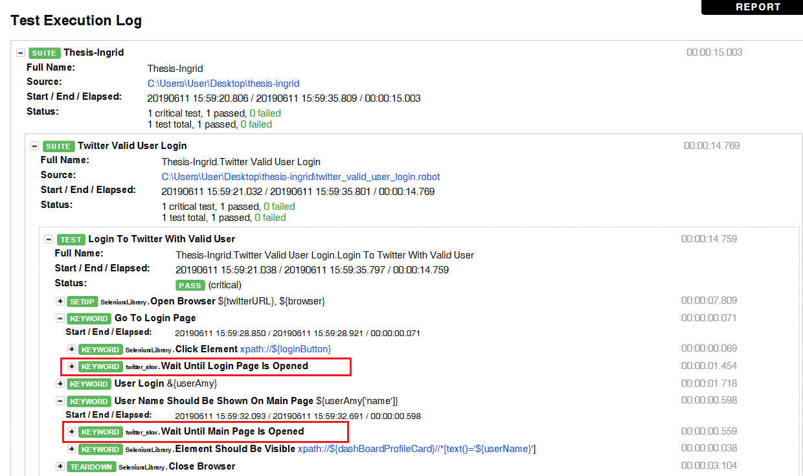

# Separating-Assistive-Keyword-In-Robot-framework

This project is reference from [Claire's thesis](https://github.com/Clairelien/Separating-Test-Actions-of-Different-Aspects-in-Robot-Framework-Test-Scripts).

Below is the instruction of how to execute my thesis:

More detail you can download my thesis from [Here](https://drive.google.com/file/d/1yjWQM29a9BkjFwG5h79DJ7oj_D2vSr7L/view?usp=sharing)

  - [Installation](#installation)
  - [Example](#example)
  - [Result](#result)
  - [Attention](#Attention)

Installation
-------
* Download [Python 3.6](https://www.python.org/downloads/release/python-360/)
  + Install
  + Path of __python36__ and __python36\Scripts__ have to set as environmental variables
  
* Download Chromedriver [version 2.37](https://chromedriver.storage.googleapis.com/index.html?path=2.37/)
  + Unzip folder
  + Put chromedriver.exe into the path of python location
  
* Install requirement libraries using pip:
  
      pip install -r requirements.txt

* Install development environment RED from [Here](https://github.com/nokia/RED)
* Import the project in RED, following the step : File->Import->Existing Projects into Workspace->Next->Select the project located place.

Example
------------------------

We provide [twitter_valid_user_login.robot](./twitter_valid_user_login.robot) sample test case.

You can run `"robot -d ./out --listener aspect/actionListener.py twitter_valid_user_login.robot"` in command line directly.

> The command above **-d ./out** means put all output file (e.g report, log...) in the out folder.
>  
Or following below steps set listener option in RED 
* Window->Preferences->Robot Framework->Launching->Default Launch Configurations->Setting arguments like below
  
      -d ./out --listener aspect/actionListener.py

    
* Then you can run the sample test like below
  
   

Result
--------
* The generated report looks like below, the red frame means that assistive keywords (written in [twitter_valid_user_login_akw](./twitter_valid_user_login_akw.robot)) are weaved into the test script successfully.
  
  

* The project would also create a [pickle file](https://docs.python.org/3.6/library/pickle.html) (listener.pickle), this file is used for saving the status of objects which contain library path and aspect that avoid rereading files when the next time running test scripts.

  

Attention
=========
  If your aspect keywords are written in python (customized keyword), please make sure the library is being referenced by RED.

  
